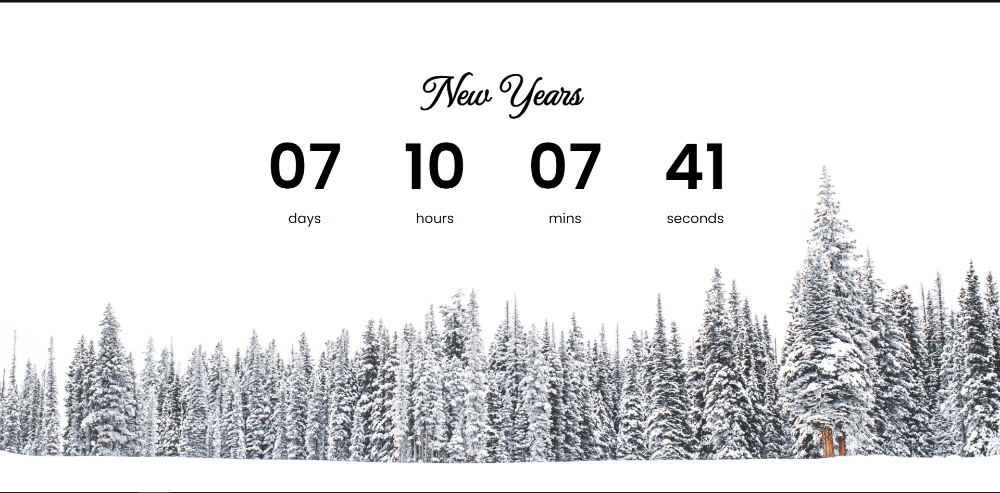
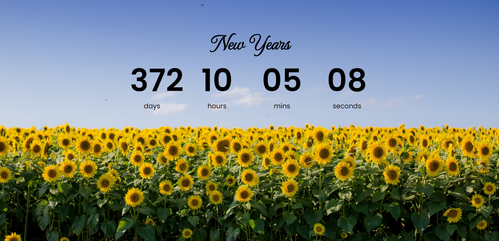
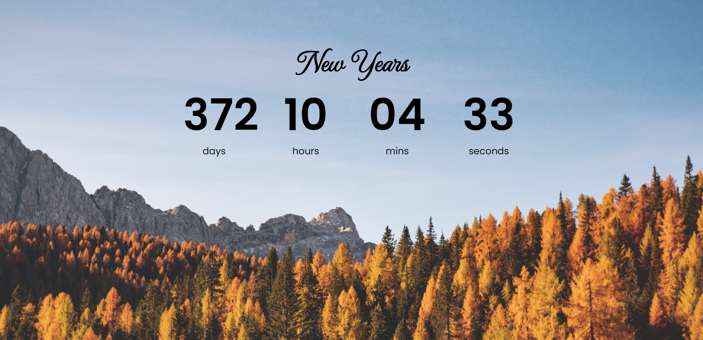
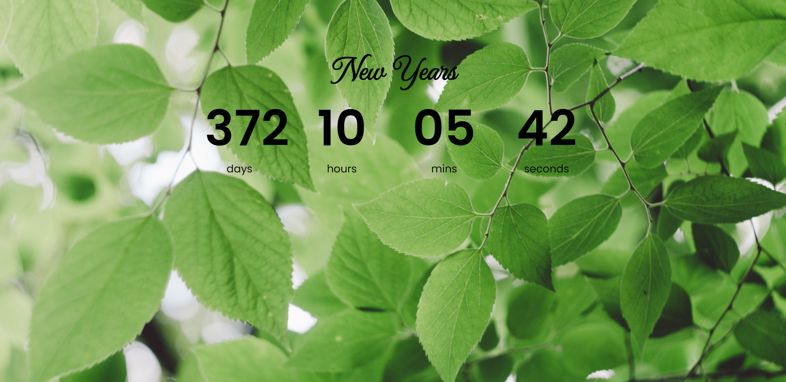

# [Pulse](https://mkaell.github.io/Timer/)

### _Application functionality:_ 
This application shows the number of days remaining until the new year . The background changes depending on the season. The timer is updated automatically.

### _Technologies used:_ 
- The application is written using **JS**.
-  There is an adaptation for all devices.

  
  
  
  

